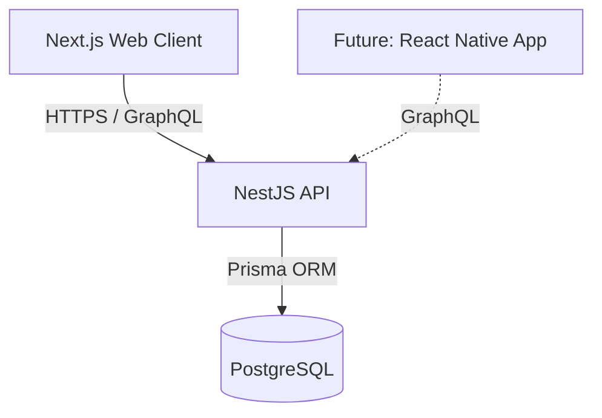
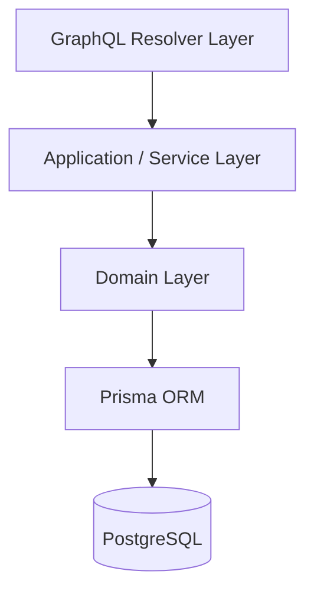

# GymFlow

GymFlow is a workout tracking application built to manage training sessions, progression, and performance metrics in a structured and scalable way.

The goal is to build something I can personally use and validate with real feedback — focusing on clean architecture and long-term maintainability from day one.

## 🚀 Project Status

Early stage.

- Architecture defined
- Frontend and backend setup completed
- Database integration in progress
- Authentication coming next

## 🏗️ System Architecture

GymFlow follows an API-first architecture where the backend acts as the single source of truth.

Frontend and backend are fully separated to keep business logic isolated in the API layer.

Current structure:

This separation allows:

- Clear responsibility boundaries
- Easier domain evolution
- Future support for additional clients (e.g. mobile)

## 🧠 Backend Architecture

The backend follows a layered structure to isolate responsibilities and keep domain logic independent from infrastructure concerns.

## 🛠️ Tech Stack

### Frontend

- Next.js (App Router)
- React Server Components
- GraphQL Client

### Backend

- NestJS
- Apollo GraphQL
- Prisma ORM
- Custom JWT authentication (in progress)

### Database

- PostgreSQL (hosted on Supabase)

## 🎯 Why This Stack?

The project is intentionally structured to:

- Keep business logic inside the API layer
- Avoid frontend-driven data modeling
- Enable flexible data fetching through GraphQL
- Maintain strong type safety across layers

The focus is not on speed alone, but on building a foundation that won't require architectural rewrites as the project evolves.

## 🔐 Authentication Strategy

Authentication will be implemented using a custom JWT-based approach instead of relying on Supabase Auth.

The goal is to:

- Control token lifecycle
- Implement access + refresh token strategy
- Keep auth logic inside the API boundary

## 📦 Future Considerations

- Workout domain modeling
- Session history and progression tracking
- Role-based access (if needed)
- Potential mobile client

## 🧠 Philosophy

GymFlow is being built as a real-world system — not just a demo project.

The emphasis is on:

- Clear boundaries
- Explicit domain modeling
- Scalable backend structure
- Iterative improvement based on real usage

## 📌 Disclaimer

This project is under active development and architectural decisions may evolve as the domain becomes clearer.
