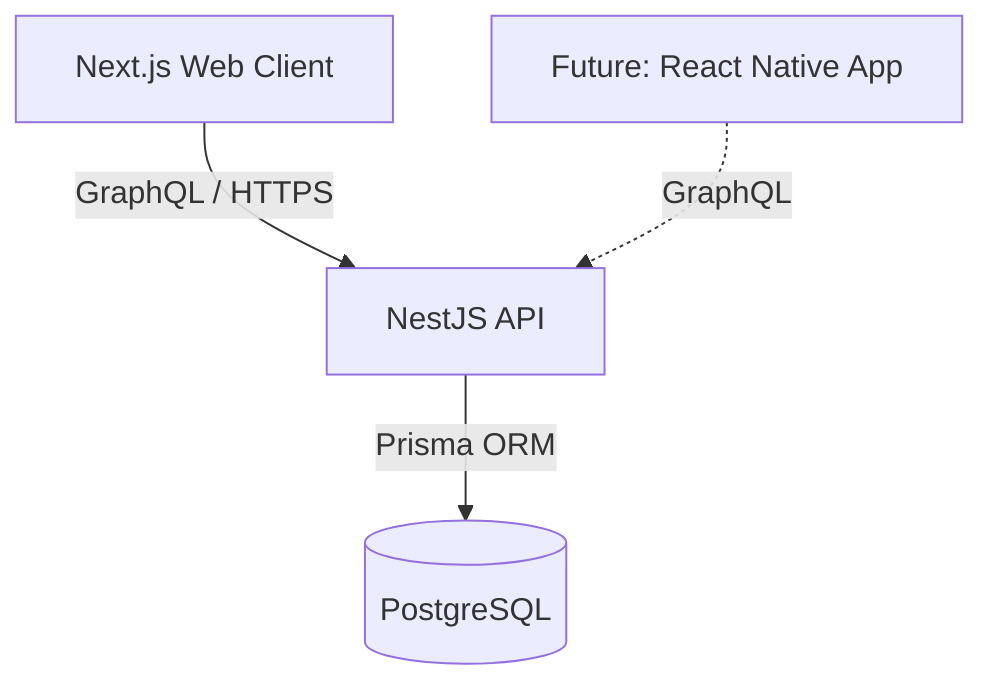
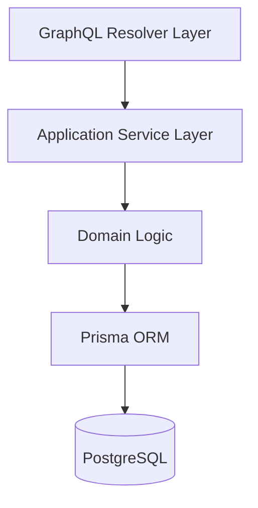
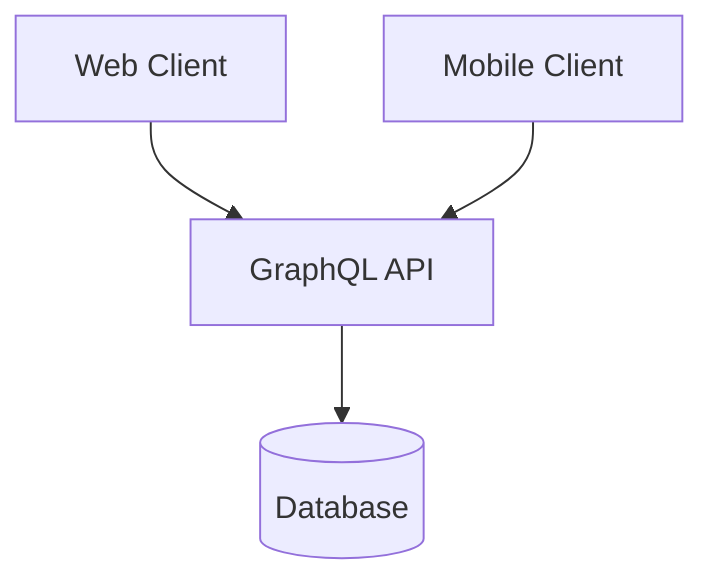

# GymFlow Architecture

This document describes the architectural decisions behind GymFlow.

The goal of the project is to build a real-world workout tracking system with clear domain boundaries, scalable backend architecture, and support for multiple clients.

GymFlow is intentionally designed as an **API-first system**, where the backend owns all business logic and clients act as consumers of the API.

---

# High-Level Architecture

GymFlow follows a **client -> API -> database** architecture.

The backend acts as the central system responsible for:

- business rules
- authentication
- domain logic
- persistence



This separation ensures that:

- the frontend remains thin
- business logic stays centralized
- new clients (such as mobile apps) can reuse the same API

---

# Monorepo Structure

The project is organized as a monorepo.

```text
gymflow/
 ├── apps/
 │   ├── web
 │   └── api
 │
 ├── packages/
 │   └── shared (future)
 │
 ├── docs
 │
 └── README.md
```

## apps/web

Next.js application responsible for the user interface.

## apps/api

NestJS application responsible for business logic and API exposure.

---

# API Layer

The API is implemented using NestJS + GraphQL (Apollo).

GraphQL is used instead of REST to better support the domain model of the application, which contains multiple nested relationships such as:

- workouts
- exercises
- sets
- performance metrics

GraphQL allows clients to request exactly the data they need without requiring multiple endpoint versions.

---

# Backend Layering

The backend follows a layered architecture to separate responsibilities and avoid tight coupling between infrastructure and domain logic.



### Resolver Layer

GraphQL resolvers act as the entry point for requests.

Responsibilities:

- input validation
- mapping GraphQL requests to services
- returning response DTOs

Resolvers should remain thin and contain no business logic.

---

### Service Layer

Services orchestrate application use cases.

Responsibilities:

- coordinating domain logic
- calling repositories or ORM
- enforcing application rules

---

### Domain Layer

The domain layer contains the core business rules of the application.

Examples of future domain concepts:

- workout templates
- training sessions
- exercise sets
- progression tracking

---

### Persistence Layer

The persistence layer is implemented with **Prisma ORM**, which provides:

- type-safe database access
- schema-driven development
- migration management

---

# Database

GymFlow uses **PostgreSQL hosted on Supabase**.

Supabase is used **only as a database provider**.

All data access happens through Prisma.

Benefits:

- strong relational model
- reliable migrations
- ability to scale later without changing architecture

**System exercises** may include an optional stable `catalogKey` (e.g. `bench_press`). The API stores the canonical English `name` plus `catalogKey`; the web app resolves the user-facing label via next-intl (`Exercises.catalog.<catalogKey>`). User-created exercises omit `catalogKey` and display their free-text `name` only.

---

# Authentication Strategy

Authentication is implemented using **JWT tokens managed by the API**.

Instead of relying on Supabase Auth, GymFlow implements its own authentication flow.

This allows:

- full control over token lifecycle
- custom access/refresh token strategy
- deeper backend architecture control

**Password reset** is handled in the API: one-time tokens are stored hashed (`PasswordResetToken`), emailed via **Resend** (`RESEND_API_KEY`, `MAIL_FROM`), or logged in development when Resend is not configured. Email HTML uses locale-specific templates (`src/mail/templates/password-reset.pt.html` and `.en.html`) chosen from the same locale segment as the reset link (`pt` / `en`). Optional `EMAIL_LOGO_URL` overrides the default `WEB_URL/logo.png` for the header image.

Future improvements may include:

- token rotation
- device/session tracking

---

# Future Architecture Evolution

GymFlow is intentionally structured to support future evolution.

Planned areas include:

### Mobile Client

A React Native client will be able to consume the same GraphQL API.



### Domain Expansion

Future domain modules may include:

- workouts
- exercise library
- training sessions
- progression analytics
- training history

---

# Architectural Principles

GymFlow follows a few guiding principles:

### Backend Owns the Logic

All business rules must live inside the API.

Clients should never implement domain logic.

---

### Explicit Domain Modeling

Entities and relationships should be clearly represented in the backend.

---

### Scalability by Design

Even though GymFlow is currently a personal project, architectural decisions aim to avoid limitations as the system grows.

---

# Session Architecture

## Source of Truth

The backend GraphQL API is the **source of truth** for all workout session data.

The frontend (`localStorage`) acts as a **resilience and offline fallback layer** only.

## Session Lifecycle

```
Start → Active (in-progress) → Finish → Summary → History / Detail
```

Each step maps to a GraphQL mutation or query:

| Step | Operation |
|------|-----------|
| Start | `startSessionFromWorkout(workoutId)` → `WorkoutSession` |
| Log set | `logSessionSet(input)` → `SessionSet` (create only, no update) |
| Finish | `finishWorkoutSession(sessionId)` → `WorkoutSession` |
| Summary | `workoutSession(id)` → read the finished session |
| History | `listUserSessions(status: COMPLETED)` |
| Detail | `workoutSession(id)` |

## localStorage Role

localStorage is used for:

- **Active session cache**: the in-progress session is persisted on every state change so a page refresh does not lose the session.
- **Offline fallback**: if an API call fails, pages fall back to locally stored data (completed sessions list, session detail).

localStorage is **never** used as the primary data source when the API responds successfully.

## Reconciliation (Active Session)

After mount, if the active session originates from the backend (`backendSynced: true`), the page fetches the current server state and merges it with the local cache deterministically:

1. Remote persisted sets are SSOT for that exercise.
2. Local pending sets (`syncedToBackend: false`) are preserved unless they collide with a remote `setNumber`.
3. `setNumber` is renormalized `1..n` after merge.
4. `exercise.completed` is recomputed as: all sets in the merged result have `completed: true`.

## Set Persistence Constraint

`logSessionSet` only supports **create**. There is no `updateSessionSet` mutation.  
Edits to weight/reps after a set is logged are not persisted to the backend in the current milestone.

## Summary URL Contract

The Summary page is addressed by URL: `/<locale>/workouts/summary?sessionId=<id>`.  
The `sessionId` query param is set by the Active Workout page on finish. The Summary page never infers the "last session" from localStorage.

---

# Disclaimer

GymFlow is under active development.

Architecture decisions may evolve as the domain becomes clearer and real usage feedback is collected.
